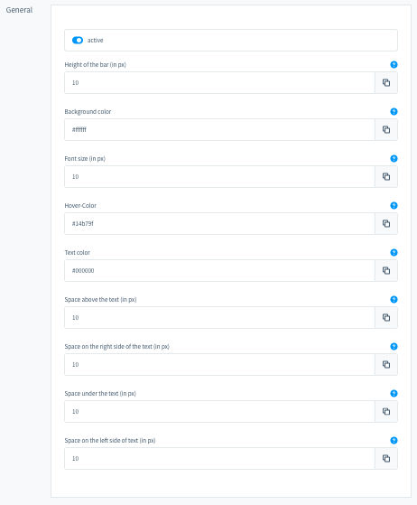
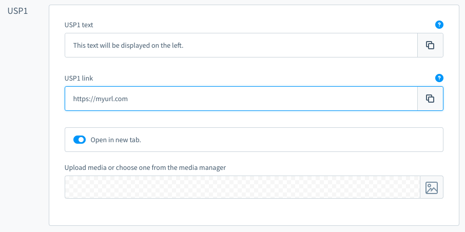
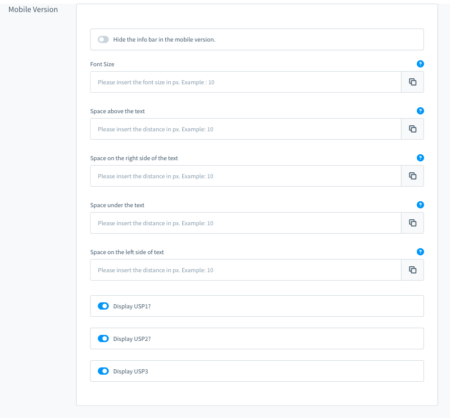
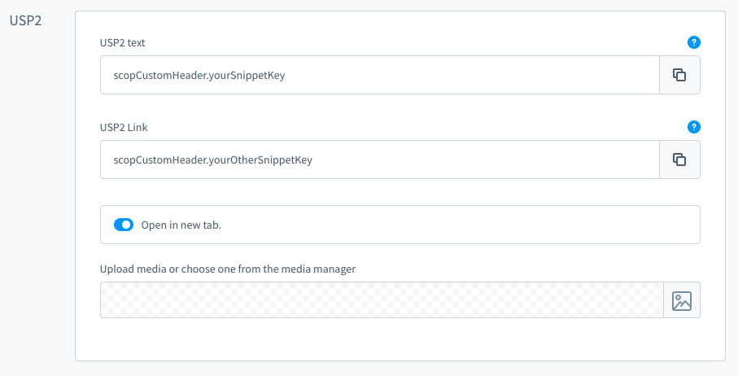
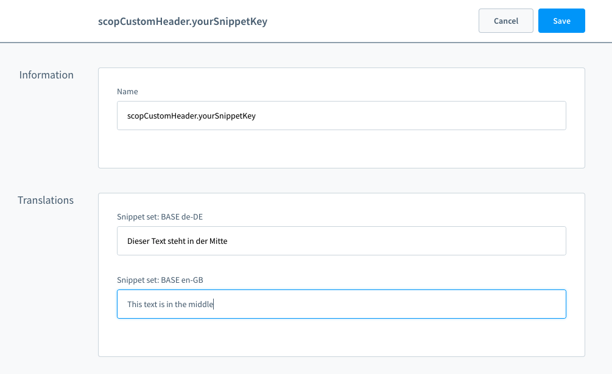

# Shopware 6 Custom Header App

| Version    | Changes                                                                             | Availability   |
|---------	|------------------------------------------------------------------------------------------- |----------------|
| 1.0.0     | First release                                                                          | Shopware Store         |

# Installation

## Zip Installation package for the Shopware Plugin Manager

* Download the [latest plugin version](https://github.com/scope01-GmbH/ScopCustomHeaderApp/releases/latest/) (
  e.g. `ScopCustomHeaderApp-1.0.0.zip`)
* Upload and install plugin using Plugin Manager

## Git Version

* Checkout Plugin in `/custom/plugins/ScopCustomHeaderApp`
* Install the Plugin with the Plugin Manager

# Configuration

To access the plugin configuration, go to the plugin manager inside the Shopware administration. There you can open the configuration of this plugin like this:

Inside the configuration, you can first select the Sales Channel which you want to configure the plugin, or simply select "All Sales Channels".

After selecting your Sales Channel, you can customize the appearance of the header. Most of the options have a blue question mark on the right, which shows additional information if you hover over them.

The configuration is split into five different sections ([General](#general), [USP1, USP2, USP3](#usp1-usp2-and-usp3), [Mobile Version](#mobile-version)).

### General

In the "General" section you can enable/disable the custom header and customize the style of the header.

### USP1, USP2 and USP3

Here you can set the text that will be displayed on the left (USP1)/in the middle (USP2)/on the right (USP3) of the header. You can also select an image and define a link for this text.
If you want to use different texts and/or different urls for different languages, follow the instructions [here](#using-translations-in-the-usp-text-or-usp-link).

### Mobile Version

In this section you can modify the appearance of the header when it is displayed on mobile devices.

## Using translations in the USP text or USP link
*(since v.1.4.0)*

When entering the text or the url of a USP, you can instead of using the untranslated text enter a snippet key. You can choose any snippet key, but it has to start with 'scopCustomHeader.'.

You can then define the translated text in the snippets using the snippet key you used in the plugin configuration.

